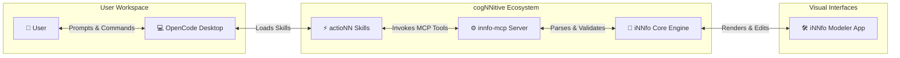

# Modular skills that give your OpenCode agent specialized powers.

Teach your AI agent domain capabilities: model evaluation, skills management, document transformation, and web design.

- [Open iNNfo Modeler App](https://innfo.cognnitive.com/app/)
- [Explore Skills Documentation](https://actionn.cognnitive.com/documentation/)

---

## Featured Skills

- **Model Router**: Evaluates whether the AI model you are using is the right fit for each task. Recommends the optimal model based on cost and capability.
- **Skills Manager**: Meta-skill that manages all skills in your repository. Scans, checks installation integrity, and manages skill lifecycles.
- **traNNsform**: Document ingestion and transformation pipeline. Converts PDFs, DOCX, and spreadsheets into structured Markdown.
- **Web Design Guide**: Complete design system with Morado Nazareno palette and presets for building responsive sites and Docsify documentation.

---

## How Skills & Tools Cooperate

---

## How to Install & Use (OpenCode)

1. **Tell Your OpenCode Agent**: Say the single bootstrap phrase in OpenCode Desktop chat: `I want to use https://cognnitive.com/use`
2. **Skills Installed Automatically**: OpenCode fetches the manifest, downloads all skills from GitHub, and presents an interactive workflow menu.
